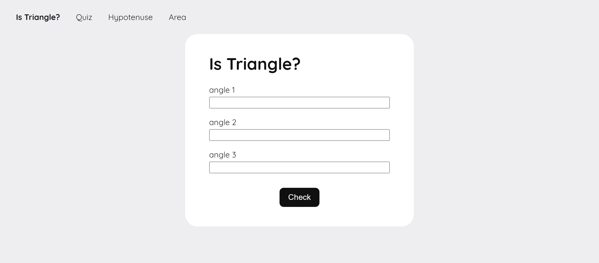
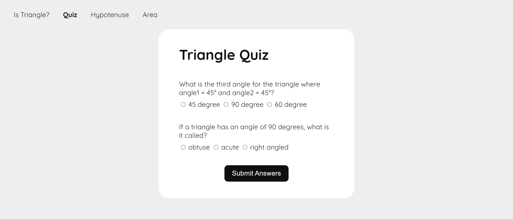
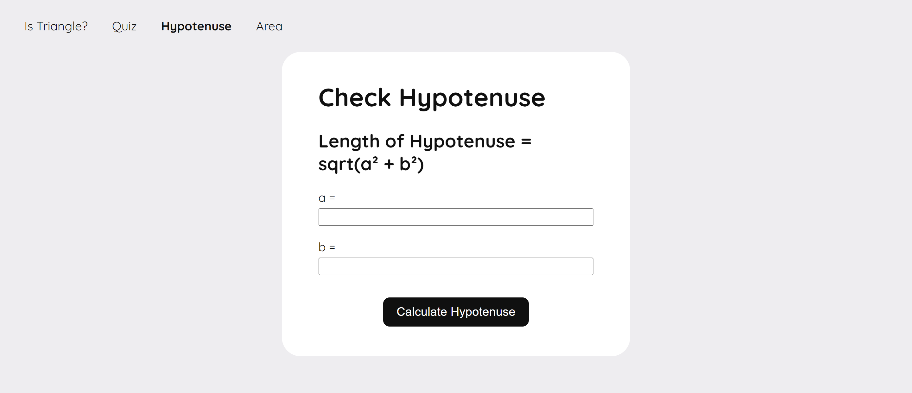
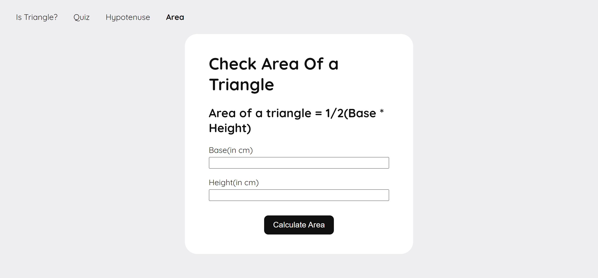

# Fun With Triangles

Check if 3 angles make a triangle.
Take a quiz on triangles.
Calculate the hypotenuse of a right angled triangle.
Calculate the area of a triangle.

## Overview

### Screenshots

### Links

- Live Site URL: [https://triangles-darshan.netlify.app/](https://triangles-darshan.netlify.app/)

### Built with

- HTML
- CSS
- JavaScript

## Author

- Twitter - [@DarshanDamre](https://twitter.com/DarshanDamre)
- LinkedIn - [Darshan Damre](https://www.linkedin.com/in/darshandamre/)
- Website - [Darshan Damre](https://darshandamre.netlify.app/)
